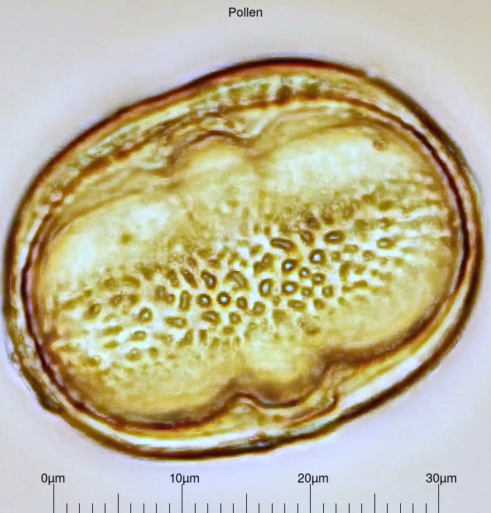

# microscopy-tools

Tools for microscopy and image focus stacking.
Some rather special tools customized for my needs.

## imgruler

Draws a ruler into an image. Needs ImageMagick.
Intended to draw a micrometer into micoscopic captures.
Contains a calibration instruction.

Runs on Linux, macOS and (in Cygwin) on MS Windows.
Considered to be ready for general use.

Dependencies:
 - imagemagick

## fusewizard

GUI frontend for image foto stacking with enfuse and imagemagick. 

Dependencies: 
 - [kaptain](https://github.com/mviereck/kaptain)
 - enfuse
 - imagemagick
 - ffmpeg
 - geeqie
 - viewnior
 - imgruler
 - From [Fred's ImageMagick Scripts](http://www.fmwconcepts.com/imagemagick/index.php):
   - whitebalance

## arduterm

Terminal to coordinate a camera on USB and an Arduino with a stepper motor. 
Designed for my microscope with a mounted camera and a steppermotor at the focus wheel.
It can show preview videos and make stackshots with tethered shooting and focus adjustment with stepper motor.
`pololu_a4988.ino` is the code in use to control the stepper motor driver with an Arduino.

Useable, but in beta stage. Currently not recommended for production use.

Dependencies:
 - gphoto2
 - ffmpeg
 - geeqie

